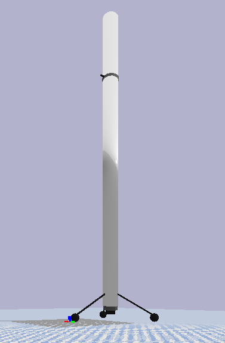

# Martlet9

Martlet9 is a simple rocket with roughly the same dimensions as the [SpaceX Falcon
9](https://www.spacex.com/falcon9). It has three fixed legs for landing, a giant thruster, and a
``steering thruster" towards the top that rotates about the axis of the rocket. Here's what it looks
like:



I am currently working on creating a gym environment for landing the Martlet9 safely starting at a
random orientation.

## Usage

To interact with Martlet9, you must have `pybullet` installed. Additionally, if you want to
customize the Martlet9, you *should* have ROS installed, but this is not absolutely necessary.

To tinker with the Martlet9's parameters (such as dimensions, masses, etc), edit the
`martlet9.urdf` file. If you have ROS, you should edit the `martlet9.urdf.xacro` file instead, and
run `make` to synthesize a new URDF file with the changes you made.

To see a little video demo of the Martlet9, you may run

```bash
python visualize.py
```
